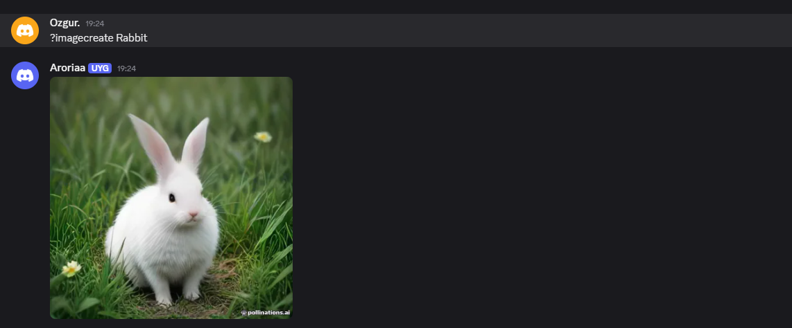

In this bot we can create images with prompt.With using "?" you can start messaging our bot. You should put your discord bot token into config.py.
With using ?imagecreate + yourprompt you can create whatever you want.

